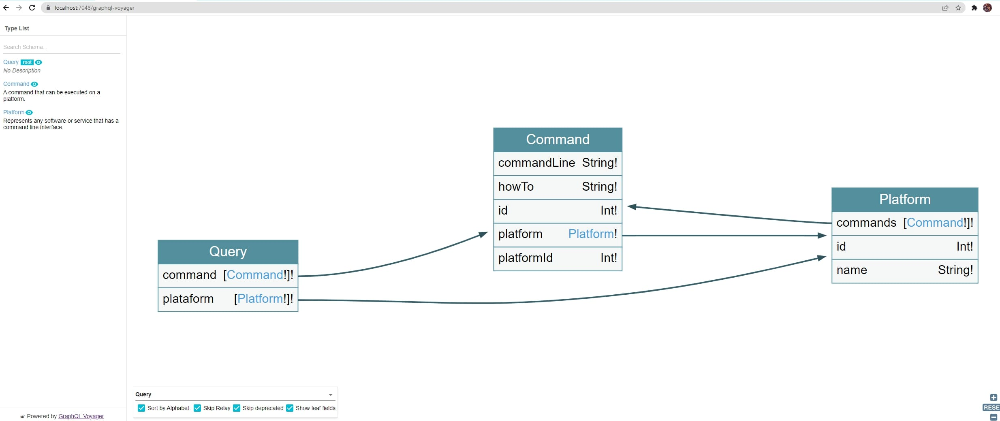

<h1 align="center" > CommanderGQL </h1>
<h2 align="center">
    <a href="https://graphql.org/">🔗 GraphQl Overview</a>
</h2>

 Uma API usando GraphQL 

 <a href="#Objetivo">Objetivo</a> •
 <a href="#Features">Features</a> •
 <a href="#Demostração">Demostração  </a> • 
 <a href="#Pre-requisitos">Pré-requisitos</a> • 
 <a href="#Tecnogias">Tecnogias Usadas  </a> • 
 <a href="#licenca">Licença  </a> • 
 <a href="#conclusao">Conclusão  </a>

<h3 align="center"> 
 Status:	Finalizado
</h4>
<h3 name = "Objetivo"> Objetivo </h3>

 Projeto com o objetivo de testar o funcionamento do GraphQL e aprender como montar uma API usando essa tecnologia 

<h3 name = "Features" >Features</h3>

 Salvar uma tecnologia no banco de dados e associar comandos a elas e realizar diversos modelos consultas e alterações neles através de uma API 

 
 <h3 name="Demostração"> Demostração</h3>
  
  
  <h3 name="Pre-requisitos" >Pré-requisitos</h3>
  
Antes de começar, você vai precisar ter instalado em sua máquina as seguintes ferramentas:

  <a href="https://dotnet.microsoft.com/en-us/download/dotnet/6.0" > .NET 6 </a>
  

  <a href="https://www.microsoft.com/pt-br/sql-server/sql-server-downloads">SQL Server 2019 </a>
    

  <a href="https://docs.docker.com/">Docker</a>
  
  <h3 name = "Tecnogias" >Tecnologias Usadas</h3>
<ul>
 <li><a href="https://docs.microsoft.com/pt-br/dotnet/csharp/">Linguagem C# </a></li>
 <li><a href="https://docs.microsoft.com/pt-br/aspnet/core/?view=aspnetcore-6.0">Asp Net Core </a></li>
 <li>  <a href="https://docs.docker.com/">Docker</a</li>
 <li><a href="https://www.microsoft.com/pt-br/sql-server/sql-server-downloads">SQL Server 2019 </a></li>
 </ul>
 
 <h3 name="licenca"> Licença </h3>
 
Esse repositório está licenciado pela MIT LICENSE. Para mais informações detalhadas, leia o arquivo <a href="https://github.com/MarlysonMendes/TestMinimalAPI/blob/main/LICENSE">LICENSE</a> contido nesse repositório.

 
 <h3 name = "conclusao"> Conclusão </h3>
 
Apesar da implementação ser mais complexa as APIs que usam o GraphQL ganham no quesito de corrigir o over e underfetching 

